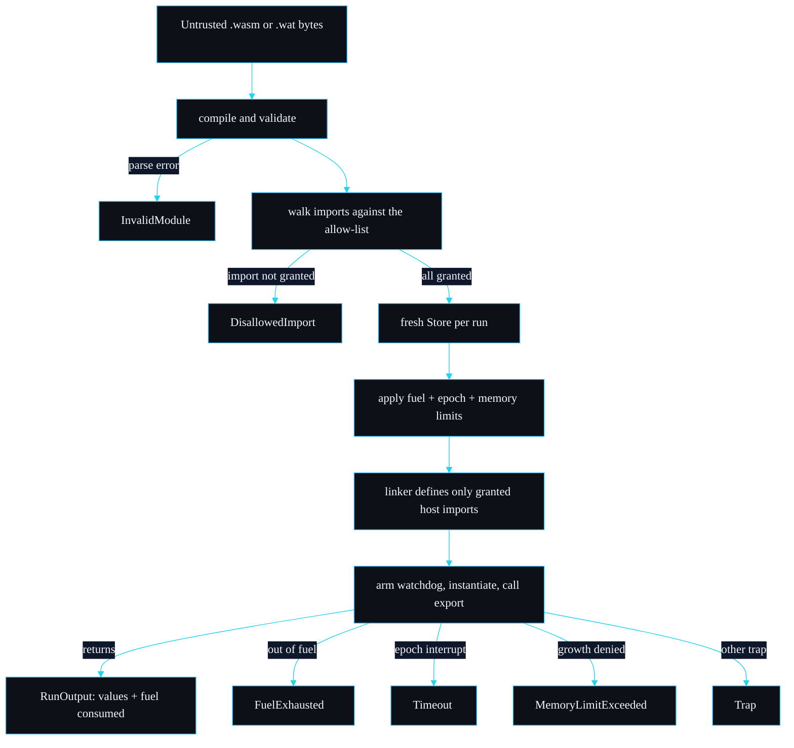

<p align="center"></p>

# sandboxd

A WebAssembly sandbox for running untrusted code with CPU, wall-clock and memory limits and a deny-by-default host ABI.

[](LICENSE)
[](https://www.rust-lang.org/)
[](https://github.com/sarmakska/sandboxd/commits/main)

## The attacks, and how each one dies

I started this project from the attacker, not the API. Here are the four hostile modules I keep in `fixtures/`, what each one tries, and the exact mechanism that stops it. Every row is a test you can run.

| Malicious module | What it attempts | How it is stopped | Error variant | Exit code |
| --- | --- | --- | --- | --- |
| `infinite_loop.wat` | spin forever on a back-edge loop | fuel runs out: each instruction deducts from the budget until zero | `FuelExhausted` | 2 |
| `infinite_loop.wat` (huge fuel) | spin forever, but with fuel set so high it never empties | the epoch watchdog bumps the engine epoch after the deadline; the guest trips at its next loop check | `Timeout` | 3 |
| `memory_bomb.wat` | call `memory.grow` in a loop until the host is starved | the `ResourceLimiter` refuses the growth at the cap; `memory.grow` returns -1; the guest's `unreachable` is reported as a cap breach | `MemoryLimitExceeded` | 4 |
| `disallowed_import.wat` | import `env::secret`, a capability that does not exist | rejected at instantiation, before any guest code runs; the error names the import | `DisallowedImport` | 5 |
| `logger.wat` (no grant) | import `host::log` without it being granted | same deny-by-default rejection; even the one known capability is off until you ask for it | `DisallowedImport` | 5 |

Two of those rows are the same fixture stopped by two different fences. That is the whole design in one line: fuel, time and memory are independent, so a guest that wriggles past one is still caught by another.

## Why I built this

The threat model came first. I wanted to run code I did not write, and did not trust, inside my own process, without giving it the process. The classic answers are a container or a VM per call, but spinning one of those up to evaluate a few hundred instructions of someone's plugin is absurd overhead, and it still leaves you trusting a much bigger surface. WebAssembly is the right shape for this: a guest cannot name an address it was not given, cannot call a function it was not handed, and runs on a runtime built for exactly this. What was missing for me was a small, auditable layer that turns wasmtime's primitives into three hard fences with a typed answer for why a run stopped. So I wrote it on top of [wasmtime](https://wasmtime.dev/): fuel metering, epoch interruption driven by a watchdog thread, a `ResourceLimiter` for memory, and a linker that defines only the imports you opt into. The host boundary is one file you can read in a coffee break.

## A run, start to finish



## Try it in two minutes

```bash
# First build compiles wasmtime and Cranelift, so it is slow. Later builds are fast.
cargo build --release

# A pure module: add(2, 40).
./target/release/sandboxd fixtures/well_behaved.wat --invoke add --arg 2 --arg 40
# result: I32(42)   (fuel consumed: 4, on stderr)

# Fuel kills an infinite loop.
./target/release/sandboxd fixtures/infinite_loop.wat --fuel 1000000          # exit 2

# A short deadline kills the same loop when fuel is effectively unlimited.
./target/release/sandboxd fixtures/infinite_loop.wat --fuel 100000000000 --timeout-ms 100   # exit 3

# The memory cap stops an over-allocating module.
./target/release/sandboxd fixtures/memory_bomb.wat --memory-mb 4 --fuel 1000000000           # exit 4

# Deny-by-default in action: the same module rejected, then granted one capability.
./target/release/sandboxd fixtures/logger.wat                # exit 5: host::log not granted
./target/release/sandboxd fixtures/logger.wat --allow-log    # [guest log] hello from the guest
```

## Embedding it

```rust
use std::time::Duration;
use sandboxd::{Sandbox, Limits, Value};

let wat = r#"(module (func (export "add") (param i32 i32) (result i32)
    local.get 0 local.get 1 i32.add))"#;

let sandbox = Sandbox::deny_all()?;
let limits = Limits::new(1_000_000, Duration::from_millis(500), 1 << 20);
let out = sandbox.run(wat.as_bytes(), "add", &[Value::I32(2), Value::I32(40)], &limits)?;
assert_eq!(out.values, vec![Value::I32(42)]);
# Ok::<(), sandboxd::SandboxError>(())
```

Granting the one audited capability and reading back what the guest logged:

```rust
use sandboxd::{HostAbi, Sandbox};

let (host, log_sink) = HostAbi::deny_all().allow_log();
let sandbox = Sandbox::new(host)?;
// ... run a module that imports host::log ...
for line in log_sink.lock().unwrap().iter() {
    println!("guest said: {line}");
}
# Ok::<(), sandboxd::SandboxError>(())
```

The public surface is deliberately small: `Sandbox`, `Limits`, `HostAbi`, `SandboxError`, `Value`, `RunOutput`. There is nothing else to learn.

## Design decisions

A few choices that are not obvious, and the alternatives I turned down.

**Fuel and epoch interruption, not one or the other.** Fuel is deterministic: the same module on the same inputs burns the same instructions every time, which is what makes it a replayable CPU bound. But fuel says nothing about wall-clock time, so a guest that calls into a slow host function, or that the platform deschedules, can hold a thread while burning almost nothing. Epoch interruption catches that. I considered shipping fuel only and calling time-bounding the embedder's problem. I rejected it because the moment you grant a host capability, time spent inside it is invisible to fuel, and a sandbox that cannot bound time is not a sandbox I would put untrusted code in front of. The two fences cost little together and cover each other's blind spot.

**A watchdog thread, not `Config::epoch_interruption` left to tick on its own.** wasmtime's epoch counter does not advance by itself; something has to call `increment_epoch`. The usual recipe is a background thread that bumps it on a fixed cadence. I went with a per-run watchdog that sleeps until the exact deadline, bumps once, and exits, polling a shared atomic so it stops early when the run finishes first. A global ticking thread is simpler to write but gives you coarse, shared timing and a thread that runs forever; the per-run watchdog gives each call its own precise deadline and no idle thread between runs. The cost is one thread spawn per run, which against the cost of compiling and running a module is in the noise.

**Deny-by-default with no WASI, instead of WASI plus a capability filter.** The tempting path is to wire in `wasmtime-wasi` and then restrict it. I did not, because WASI's surface is large and its preview is still moving, and "grant all of WASI then claw things back" is exactly the deny-list posture that leaks. Starting from nothing and adding one audited function (`host::log`) means the allow-list is short enough to read in full and the default is the safe one. If you need files or sockets, that is a real need and WASI is the right tool, but it is a different project from this one.

**A typed `SandboxError` per failure mode, not an opaque error with a message.** I wanted callers to branch on *why* a run stopped (bill it, retry it, ban the module) without scraping strings. So fuel exhaustion, timeout, memory breach, disallowed import, invalid module, export mismatch and a generic guest trap are each their own variant, and the CLI maps each to its own exit code.

## Numbers

Measured on an Apple M3 Pro (macOS 26.3, Rust 1.96, `--release`), driving the CLI against the shipped fixtures.

| Scenario | Result |
| --- | --- |
| `add(2, 40)` | returns `I32(42)`, fuel consumed `4` |
| `fib(30)` | returns `I32(832040)`, fuel consumed `522`, identical on every run |
| 100 cold CLI invocations of `fib(30)` | 1.06 s total, about 10.6 ms per process including OS spawn and module compile |
| infinite loop, 1,000,000 fuel | stopped, exit 2 |
| infinite loop, 100 ms timeout, near-infinite fuel | stopped; wall time about 145 ms end to end across three runs (the extra over 100 ms is process spawn plus compile, not deadline slack) |
| memory bomb, 4 MiB cap | stopped, exit 4 |

The determinism is the result I care about most: `fib(30)` consumes exactly 522 fuel every single time, which is what lets fuel double as a quota or a billing unit you can reproduce.

## Limitations and non-goals

What this is not, stated plainly because real projects say so.

- **Not a defence against side channels.** Timing, cache and speculative-execution leaks between guests sharing a machine are out of scope. If you run mutually distrusting guests, sandboxd does not stop one inferring things about another through microarchitectural state.
- **Not protection from denial of service within the limits.** A guest that stays under its fuel, time and memory budgets can still spend the whole budget on every call. Provisioning and rate limiting are yours.
- **Only as sound as wasmtime.** The isolation rests on wasmtime and Cranelift being correct. An escape there is an escape here. Keep the dependency current.
- **No WASI, on purpose.** If your guest legitimately needs files, sockets or a clock, this is the wrong tool and I will not be adding WASI to it.
- **i32 arguments only on the CLI.** The library takes the full scalar set (`i32`, `i64`, `f32`, `f64`); the CLI keeps things simple. For richer arguments or return values, embed the library.

## Roadmap

Things I intend to do, and a couple I have decided against.

- A small set of additional audited capabilities behind explicit grants, each following the `host::log` recipe: a monotonic clock and a seeded RNG are the likely first two, because they are common needs that are easy to make safe.
- Per-run fuel and memory consumption returned together, so an embedder can size limits from one observed run.
- Optional `.wasm` precompilation and caching for embedders that run the same module repeatedly.
- I will not add a plugin manager, a package format or a network of any kind. The scope is "run these bytes under these limits and tell me what happened", and I want it to stay that small.

## Documentation

The full design lives in the [wiki](https://github.com/sarmakska/sandboxd/wiki), a deep multi-page reference. Start at the [Home](https://github.com/sarmakska/sandboxd/wiki/Home) navigation table. Highlights: [Architecture](https://github.com/sarmakska/sandboxd/wiki/Architecture) and [The Sandbox Engine](https://github.com/sarmakska/sandboxd/wiki/The-Sandbox-Engine) for the internals, [The Watchdog and Epoch Interruption](https://github.com/sarmakska/sandboxd/wiki/The-Watchdog-and-Epoch-Interruption) for the wall-clock fence, [API Reference](https://github.com/sarmakska/sandboxd/wiki/API-Reference) and [Error Reference](https://github.com/sarmakska/sandboxd/wiki/Error-Reference) for the surface, [Threat Model](https://github.com/sarmakska/sandboxd/wiki/Threat-Model) and [Design Decisions](https://github.com/sarmakska/sandboxd/wiki/Design-Decisions) for the reasoning, [Configuration and Tuning](https://github.com/sarmakska/sandboxd/wiki/Configuration-and-Tuning) and [Performance and Benchmarks](https://github.com/sarmakska/sandboxd/wiki/Performance-and-Benchmarks) for operating it, [Writing a Guest Module](https://github.com/sarmakska/sandboxd/wiki/Writing-a-Guest-Module) and [Writing a Host Capability](https://github.com/sarmakska/sandboxd/wiki/Writing-a-Host-Capability) for extending it, plus [Comparisons](https://github.com/sarmakska/sandboxd/wiki/Comparisons), [FAQ](https://github.com/sarmakska/sandboxd/wiki/FAQ), [Troubleshooting](https://github.com/sarmakska/sandboxd/wiki/Troubleshooting) and [Roadmap and Limitations](https://github.com/sarmakska/sandboxd/wiki/Roadmap-and-Limitations).

## Licence

MIT. See [LICENSE](LICENSE).

---
Built by Sarma. Part of the SarmaLinux open-source line.
Website: https://sarmalinux.com  .  GitHub: https://github.com/sarmakska
