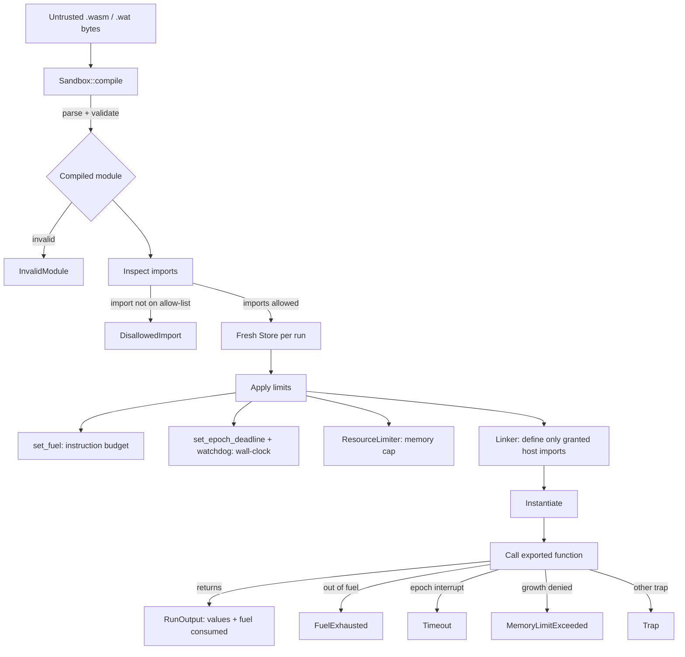

# sandboxd

> A WebAssembly sandbox for running untrusted code with CPU, wall-clock and memory limits and a deny-by-default host ABI.

[](LICENSE)
[](https://www.rust-lang.org/)
[](https://github.com/sarmakska/sandboxd/commits/main)

sandboxd runs untrusted `.wasm` and `.wat` modules under three independent, enforced limits: a deterministic instruction budget (fuel), a wall-clock deadline (epoch interruption) and a linear memory cap. The host surface is deny-by-default: there is no WASI and no ambient host functions, so a guest can only call capabilities the embedder explicitly grants, and an allow-list violation is rejected before any guest code runs. It ships as both a library you embed and a CLI you point at a module.

## Why I built this

I wanted a small, auditable answer to a recurring question: how do you run code you do not trust without handing it the keys to the process? The interesting parts of that problem are the enforcement boundaries, so I implemented them for real on top of [wasmtime](https://wasmtime.dev/): fuel metering, epoch-based interruption with a watchdog thread, a `ResourceLimiter` for memory, and a linker that defines only the imports you opt into. The error surface is typed, so an embedder can tell exactly why a run stopped.

## Architecture



## Quickstart

```bash
# 1. Build the CLI (the first build compiles wasmtime and is slow; later builds are fast).
cargo build --release

# 2. Run a well-behaved module: add(2, 40).
./target/release/sandboxd fixtures/well_behaved.wat --invoke add --arg 2 --arg 40

# 3. Watch fuel metering kill an infinite loop.
./target/release/sandboxd fixtures/infinite_loop.wat --fuel 1000000

# 4. Watch the memory cap stop an over-allocating module.
./target/release/sandboxd fixtures/memory_bomb.wat --memory-mb 4 --fuel 1000000000

# 5. See the deny-by-default host reject an unapproved import, then allow one capability.
./target/release/sandboxd fixtures/logger.wat                # rejected: host::log not granted
./target/release/sandboxd fixtures/logger.wat --allow-log    # captured: "hello from the guest"
```

Each failure category exits with a distinct code: `2` fuel, `3` timeout, `4` memory, `5` disallowed import, `6` invalid module, `7` export error, `8` guest trap.

## Library usage

```rust
use std::time::Duration;
use sandboxd::{Sandbox, Limits, Value};

let wat = r#"(module (func (export "add") (param i32 i32) (result i32)
    local.get 0 local.get 1 i32.add))"#;

let sandbox = Sandbox::deny_all()?;
let limits = Limits::new(1_000_000, Duration::from_millis(500), 1 << 20);
let out = sandbox.run(wat.as_bytes(), "add", &[Value::I32(2), Value::I32(40)], &limits)?;
assert_eq!(out.values, vec![Value::I32(42)]);
# Ok::<(), sandboxd::SandboxError>(())
```

To grant the audited log capability:

```rust
use sandboxd::{HostAbi, Sandbox};

let (host, log_sink) = HostAbi::deny_all().allow_log();
let sandbox = Sandbox::new(host)?;
// ... run a module that imports host::log ...
for line in log_sink.lock().unwrap().iter() {
    println!("guest said: {line}");
}
# Ok::<(), sandboxd::SandboxError>(())
```

## What is in the box

- `Sandbox`: a reusable engine that compiles and runs modules under limits.
- `Limits`: fuel, wall-clock timeout, and memory and table caps, with tight defaults.
- `HostAbi`: deny-by-default capability grants. Today the one audited capability is `host::log`.
- `SandboxError`: a typed error per failure mode so callers branch on the reason, not a string.
- A CLI with flags for fuel, timeout, memory, arguments and capability grants.
- Five `.wat` fixtures covering the infinite loop, memory bomb, disallowed import, logger and a pure module.
- An integration test suite that asserts each guarantee, including determinism.

## When to use this, and when not to

Use sandboxd when you need to run small, untrusted compute units (plugins, user-submitted functions, rule evaluators, scoring functions) with hard ceilings on CPU, time and memory, and a host surface you control to the byte. It is a good fit for in-process isolation where you do not want to spin up a container or VM per call.

Do not reach for sandboxd when the guest legitimately needs broad system access (files, sockets, clocks); that is what WASI exists for, and granting it would undo the point of this project. It is also not a defence against side-channel attacks or against bugs in wasmtime itself; see the [Threat Model](https://github.com/sarmakska/sandboxd/wiki/Threat-Model) for exactly what is and is not in scope.

## Results

Measured on the development machine (Apple Silicon, release build):

| Scenario | Outcome | Notes |
| --- | --- | --- |
| `fib(30)` pure module | returns `832040`, fuel consumed `522` | identical fuel across every run |
| 100 cold CLI invocations of `fib(30)` | about 1.15s total | roughly 11 ms per process including OS spawn |
| infinite loop, 1,000,000 fuel | stopped, exit `2` | deterministic, independent of wall clock |
| infinite loop, 100 ms timeout | stopped near 100 ms, exit `3` | epoch watchdog interrupts a pure spin loop |
| memory bomb, 4 MiB cap | stopped, exit `4` | growth denied at the cap |

The determinism is the headline result: a pure module consumes exactly the same fuel on every run, which is what makes fuel a reliable, replayable CPU bound.

## Documentation

The full design lives in the [wiki](https://github.com/sarmakska/sandboxd/wiki):

- [Home](https://github.com/sarmakska/sandboxd/wiki/Home)
- [Architecture](https://github.com/sarmakska/sandboxd/wiki/Architecture)
- [Threat Model](https://github.com/sarmakska/sandboxd/wiki/Threat-Model)
- [Resource Limits](https://github.com/sarmakska/sandboxd/wiki/Resource-Limits)
- [Host ABI](https://github.com/sarmakska/sandboxd/wiki/Host-ABI)
- [CLI Usage](https://github.com/sarmakska/sandboxd/wiki/CLI-Usage)
- [Troubleshooting](https://github.com/sarmakska/sandboxd/wiki/Troubleshooting)

## Licence

MIT. See [LICENSE](LICENSE).
