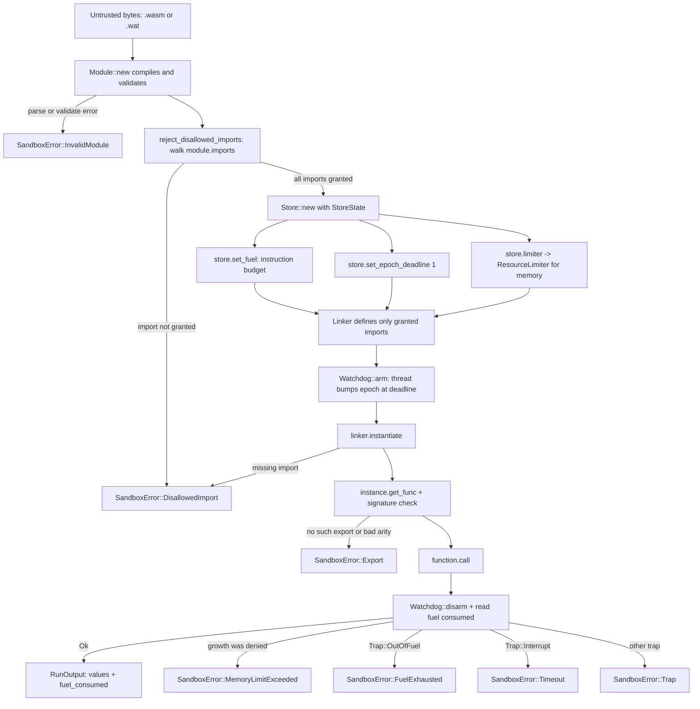

# Architecture

sandboxd is a thin, opinionated layer over [wasmtime](https://wasmtime.dev/). wasmtime does the heavy lifting of compiling and executing WebAssembly; sandboxd's job is to wire up the enforcement so that running untrusted code is safe by construction, and to present a small typed API.

## Module layout

| File | Responsibility |
| --- | --- |
| `src/lib.rs` | The public surface. Re-exports `Sandbox`, `Limits`, `HostAbi`, `Value`, `RunOutput`, `SandboxError`. |
| `src/sandbox.rs` | The engine. Compiles modules, applies limits to a fresh store, instantiates and calls the export, classifies traps. |
| `src/limits.rs` | `Limits` plus the `StoreState` that implements wasmtime's `ResourceLimiter`. |
| `src/host.rs` | `HostAbi`: the deny-by-default allow-list and the audited `host::log` import. |
| `src/error.rs` | `SandboxError`: a typed variant per failure mode. |
| `src/main.rs` | The CLI. Parses flags, builds the host and limits, runs, maps errors to exit codes. |

## The engine

A `Sandbox` builds a wasmtime `Engine` once with three configuration choices that the rest of the design depends on:

```rust
let mut config = Config::new();
config.consume_fuel(true);          // enable the deterministic instruction budget
config.epoch_interruption(true);    // enable cooperative wall-clock interruption
config.cranelift_opt_level(wasmtime::OptLevel::Speed);
let engine = Engine::new(&config)?;
```

The engine is reference counted internally and safe to share, so you create one per process and reuse it across runs. Each call to `Sandbox::run` builds a fresh `Store`, which means runs share no linear memory, no globals and no fuel; one run cannot influence the next.

## The instantiate-and-limit flow



The ordering matters. We reject disallowed imports before building the store, so a hostile module that imports something it should not is turned away before any of its code can run. We arm the watchdog immediately before the call and disarm it immediately after, so the wall-clock window covers exactly the guest's execution.

## How a trap is classified

When `function.call` returns an error, sandboxd has to decide why. The logic lives in `Sandbox::run` and `classify_trap`:

1. First it checks `store.data().growth_was_denied()`. The `ResourceLimiter` sets this flag the moment a memory or table growth is refused at the cap. This is checked first because a guest that hits the cap may react in several ways (an `unreachable`, an out-of-bounds store, or simply trapping), and they should all be reported as a memory limit breach.
2. Otherwise it downcasts the error to a wasmtime `Trap` and matches the code: `OutOfFuel` becomes `FuelExhausted`, `Interrupt` becomes `Timeout`, and a memory or table out-of-bounds becomes `MemoryLimitExceeded`.
3. Anything else is a genuine guest fault and becomes `SandboxError::Trap` carrying the backtrace.

## The watchdog

wasmtime's epoch interruption is cooperative: the guest checks an epoch counter at loop back-edges and function entries, and traps if the store's deadline has passed. sandboxd sets the store deadline to one epoch tick and then runs a `Watchdog` thread that sleeps in short slices until the wall-clock timeout elapses, at which point it calls `engine.increment_epoch()`. That bump trips the guest at its next check. The watchdog polls a shared atomic flag so that when a run finishes early it exits promptly rather than always sleeping the full timeout.

This thread-based approach is what lets sandboxd stop a guest that is spinning in pure computation, where there is no host call to piggyback on.

## Why a fresh store per run

State isolation is a correctness property, not just hygiene. Fuel is stored on the store; so is the epoch deadline and the resource limiter. By building a new store each run we guarantee that the budget is exactly what the caller asked for and that no residue from a previous run can change a later one. The engine, which holds the expensive compiled artefacts and the Cranelift backend, is the part that is reused.
