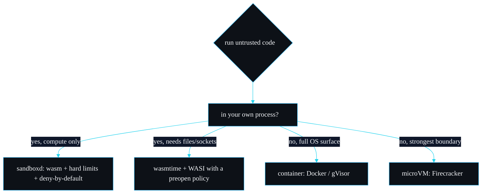

# Comparisons

Where sandboxd sits relative to the obvious alternatives for running untrusted code. The honest framing: sandboxd is a small, opinionated layer over wasmtime for one job, running untrusted compute in-process under hard limits with no ambient authority. It is not trying to be a general runtime, a container, or a WASI platform. The comparisons below are about fit, not about one being better in the abstract.

## The landscape

## sandboxd vs raw wasmtime

wasmtime is the engine sandboxd is built on, so this is really "sandboxd vs wiring wasmtime yourself".

| | Raw wasmtime | sandboxd |
| --- | --- | --- |
| CPU bound | you set `consume_fuel` and manage fuel | done, plus reported `fuel_consumed` |
| Wall-clock bound | you wire epoch interruption and a ticker | done, per-run watchdog |
| Memory cap | you implement `ResourceLimiter` | done, with precise breach attribution |
| Import policy | you choose what to define on the linker | deny-by-default, explicit allow-list, named rejections |
| Error surface | wasmtime errors and traps | typed `SandboxError` per failure mode |
| Surface area | the whole wasmtime API | six public types |

If you need wasmtime's full surface (components, async, custom resource types, multiple memories, the GC proposal), use wasmtime directly. sandboxd deliberately exposes only what the "run untrusted compute under limits" job needs, and makes the safe configuration the default rather than something you assemble correctly yourself.

## sandboxd vs wasmtime-wasi

WASI gives a guest a POSIX-shaped interface: files, clocks, environment, sockets in newer previews, mediated by the host. wasmtime-wasi with a `preopen` policy is the standard way to run a WASI guest with some access.

The difference is the default posture. WASI starts from a broad surface you restrict (a deny-list: grant all of WASI, then claw back). sandboxd starts from nothing and adds one audited function (`host::log`), an allow-list. For untrusted code, the allow-list default is the one that fails safe: a capability you forget to deny in WASI is granted, whereas a capability you forget to grant in sandboxd is denied.

Use WASI when the guest legitimately needs filesystem or network and you are prepared to write and audit the preopen policy. Use sandboxd when the guest is pure compute (or compute plus a tiny, audited capability) and you want the smallest possible thing to trust. They solve different trust problems; sandboxd does not try to be a WASI platform, and the [Design Decisions](Design-Decisions) page explains why.

## sandboxd vs containers (Docker, gVisor)

A container isolates a whole process tree with namespaces and cgroups (or, with gVisor, a user-space kernel). It is the right tool when the untrusted thing is an arbitrary program that expects an OS.

| | Container | sandboxd |
| --- | --- | --- |
| Granularity | a process / image | a function call |
| Startup | tens to hundreds of ms, plus image pull | sub-call after one compile; ~10 ms cold including process spawn in testing |
| Trusted surface | the OS kernel (or gVisor's) plus the runtime | wasmtime plus six small files |
| In-process | no, separate process | yes, runs in your address space |
| Resource accounting | cgroups, coarse | deterministic per-instruction fuel |

Spinning up a container to evaluate a few hundred instructions of someone's plugin is heavy, and it still leaves you trusting a much larger surface. sandboxd's whole reason for existing (see "Why I built this" in the README) is the in-process, per-call case where a container is the wrong shape. If you must run an arbitrary OS-level program, a container is the right answer and sandboxd is not.

## sandboxd vs microVMs (Firecracker)

A microVM gives the strongest practical boundary: hardware virtualisation, a separate kernel, minimal device surface. It is what you reach for when the threat justifies the weight, for example multi-tenant code execution at a cloud boundary.

sandboxd is much lighter and much smaller to trust, but the boundary is software (wasmtime), and it runs in your process. The trade is boundary strength and OS compatibility against startup cost, footprint and granularity. A microVM cannot meter at the instruction level the way fuel does, and it cannot run in-process; sandboxd cannot match a separate kernel's isolation. Different points on the same axis.

## Honest summary

- **Pure or near-pure untrusted compute, in-process, per call, smallest trusted surface:** sandboxd.
- **Untrusted code that needs files or sockets, and you will write the policy:** wasmtime-wasi.
- **An arbitrary program expecting an OS:** a container.
- **Multi-tenant isolation where the threat justifies the weight:** a microVM.

sandboxd is good at one of these and does not pretend to be good at the others. The non-goals in [Roadmap and Limitations](Roadmap-and-Limitations) say the same thing from the other direction.

---
SarmaLinux . sarmalinux.com . [repo](https://github.com/sarmakska/sandboxd)
