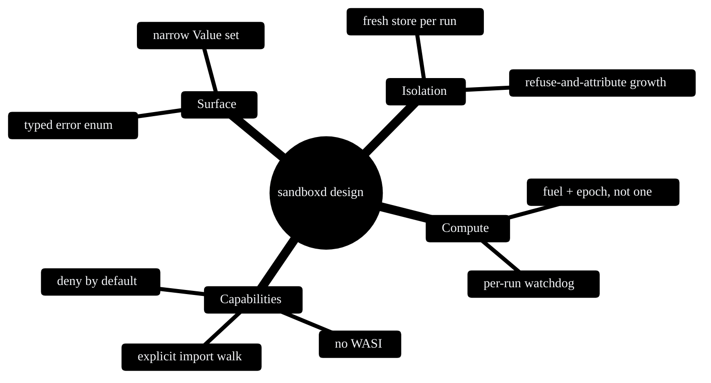

# Design Decisions

The choices that shaped sandboxd, each with the alternatives I weighed and turned down. A project's design is best understood through the roads not taken, so this page names them. Some of this overlaps the [Architecture](Architecture) page; here it is collected in one place and argued out.

## Two fences for compute, not one

**Decision:** enable both fuel metering (`Config::consume_fuel`) and epoch interruption (`Config::epoch_interruption`).

**Rejected: fuel only.** Fuel is deterministic and replayable, which is exactly what you want for a CPU quota. But it is blind to wall-clock time. The moment you grant a host capability, time spent inside the host call consumes no fuel, so a guest could call a slow granted function in a loop and hold a thread indefinitely while burning almost nothing. A sandbox that cannot bound time is not one I would put untrusted code in front of.

**Rejected: time only.** Bounding wall-clock time alone throws away the replayable CPU bound that makes fuel useful as a quota or a billing unit. Two callers running the same module on the same input would get non-deterministic costs.

**Why both wins:** each covers the other's blind spot, and carrying both is cheap. Fuel gives the deterministic instruction bound; the epoch deadline gives the wall-clock backstop for everything fuel cannot see. This is the core of the [Threat Model](Threat-Model) guarantees 1 and 2.

## A per-run watchdog thread, not a global epoch ticker

**Decision:** spawn a `Watchdog` thread per run that sleeps until that run's exact deadline, bumps the epoch once, and exits, polling a shared `AtomicBool` so it stops early when the call returns first.

**Rejected: one long-lived ticker thread** that calls `increment_epoch` on a fixed cadence for the life of the process. It is slightly less code, but it gives coarse, shared timing (every store sees the same cadence) and a thread that never dies even when nothing is running.

**Why the per-run watchdog wins:** each call gets its own precise deadline, there is no idle thread between runs, and a fast run pays only the spawn-and-join cost because the `done` flag stops the thread immediately. The price is one `thread::spawn` per run, which against the cost of compiling and running a module is in the noise (see [Performance and Benchmarks](Performance-and-Benchmarks)). The full mechanism is on [The Watchdog and Epoch Interruption](The-Watchdog-and-Epoch-Interruption).

## Inspect imports ourselves before instantiation

**Decision:** `reject_disallowed_imports` walks `module.imports()` and rejects anything off the allow-list before the store is built, naming the exact offending import.

**Rejected: rely on the linker alone.** wasmtime would also reject an undefined import at `Linker::instantiate`, so the explicit walk looks redundant.

**Why the explicit walk wins:** doing it first means the rejection happens before any store or guest setup exists, and it lets us name the precise import (`env::secret`, `host::log`) in the error rather than parsing wasmtime's message. It is deliberate belt-and-braces: `map_instantiation_error` still translates a late instantiation failure back into `DisallowedImport`, so both layers agree. If one check were ever bypassed, the other still holds.

## Deny-by-default with no WASI, not WASI plus a filter

**Decision:** start from nothing. A fresh `HostAbi` grants no imports. The embedder opts in to each capability by name; the one shipped today is `host::log`.

**Rejected: wire in `wasmtime-wasi` and restrict it.** WASI's surface is large and its preview is still moving. "Grant all of WASI then claw things back" is exactly the deny-list posture that leaks: every new WASI function is a new thing to remember to deny.

**Why deny-by-default wins:** the allow-list is short enough to read in full, and the default is the safe one. A guest compiled against `wasm32-wasi` is rejected at instantiation rather than silently handed host facilities. If you genuinely need files or sockets, WASI is the right tool, but that is a different trust decision and a different project. See [Host ABI](Host-ABI).

## A typed error enum, not a string or an `anyhow` blob

**Decision:** every stop reason an embedder might act on is its own `SandboxError` variant.

**Rejected: a single opaque error with a message.** Less matching code, but it forces callers to scrape strings to decide whether to bill a run, retry it, or ban a module.

**Why the typed enum wins:** callers branch on the reason directly, and the CLI maps each variant to its own process exit code so shell scripts can do the same. The cost is a little more matching in `classify_trap`; the benefit is a stable, machine-readable contract. See [Error Reference](Error-Reference).

## A fresh store per run, reusing the engine

**Decision:** build a new `wasmtime::Store` on every `run`, but reuse the `Engine` for the life of the `Sandbox`.

**Rejected: reuse the store across runs.** It would save the per-run setup, but fuel, the epoch deadline, the resource limiter, linear memory and globals all live on the store. Reusing it would let residue from one run change the next, which breaks both determinism and isolation.

**Why fresh-store wins:** state isolation becomes a structural property, not something to remember to reset. The expensive part (compiled artefacts, the Cranelift backend) lives on the engine and is reused; the cheap part (the store) is rebuilt. Guarantee 6 in the [Threat Model](Threat-Model) rests on this.

## A narrow `Value` set, not the full wasm value space

**Decision:** the public `Value` enum is `i32`, `i64`, `f32`, `f64` only. Reference types and `v128` are excluded.

**Rejected: expose every wasm value type.** It would be more complete, but reference types and SIMD widen the boundary the embedder has to reason about, and most untrusted-compute use cases pass scalars.

**Why the narrow set wins:** the ABI stays small and auditable, and an unsupported return type produces a clean `SandboxError::Export` rather than a surprise. The narrowing is documented at the `Value` definition in `src/sandbox.rs`.

## Refuse growth rather than abort, then attribute it precisely

**Decision:** the memory limiter is built with `trap_on_grow_failure(false)`, so an over-cap `memory.grow` returns -1 to the guest rather than aborting. A `growth_denied` flag records the refusal, and `run` checks that flag before classifying any trap.

**Rejected: `trap_on_grow_failure(true)`.** It would abort the growth directly, but it loses the ability to attribute the eventual trap precisely, because a guest can react to a refused growth in several ways.

**Why refuse-and-attribute wins:** whatever the guest does after a refused growth (an `unreachable`, an out-of-bounds store, a plain trap), checking `growth_was_denied()` first means the run is reported as `MemoryLimitExceeded` every time. The attribution is correct without depending on the guest's reaction. See [The Sandbox Engine](The-Sandbox-Engine).

## Summary

---
SarmaLinux . sarmalinux.com . [repo](https://github.com/sarmakska/sandboxd)
