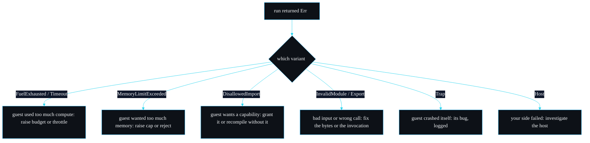

# Error Reference

Every way a run can stop, as a typed `SandboxError` variant. This is the companion to [Troubleshooting](Troubleshooting): that page is task-oriented ("I hit this, how do I fix it"); this one is the reference ("what is each variant, where is it raised, what does it carry"). The definitions are in `src/error.rs`; the CLI exit-code mapping is in `src/main.rs`.

## The enum

```rust
#[derive(Debug, Error)]
pub enum SandboxError {
    FuelExhausted { budget: u64 },
    Timeout { millis: u64 },
    MemoryLimitExceeded { limit: usize },
    DisallowedImport { module: String, name: String },
    InvalidModule(String),
    Export(String),
    Trap(String),
    Host(String),
}
```

It derives `Debug` and, through `thiserror`, implements `Display` and `std::error::Error`, so it works with `?`, `anyhow`, `eyre` and `Box<dyn Error>`.

## The variants

| Variant | Raised in | Carries | CLI exit code | Display |
| --- | --- | --- | --- | --- |
| `FuelExhausted` | `classify_trap` on `Trap::OutOfFuel` | `budget: u64` | 2 | `fuel exhausted: the module exceeded its instruction budget of {budget} units` |
| `Timeout` | `classify_trap` on `Trap::Interrupt` | `millis: u64` | 3 | `wall-clock timeout: the module ran longer than {millis} ms` |
| `MemoryLimitExceeded` | `run` (growth denied) and `classify_trap` (out-of-bounds) | `limit: usize` | 4 | `memory limit exceeded: the module requested more than {limit} bytes of linear memory` |
| `DisallowedImport` | `reject_disallowed_imports`, `map_instantiation_error` | `module: String`, `name: String` | 5 | `disallowed import: the module imports {module}::{name} which is not on the allow-list` |
| `InvalidModule` | `compile` | `String` (wasmtime message) | 6 | `invalid module: {0}` |
| `Export` | `get_func`, `check_signature`, result conversion | `String` | 7 | `export error: {0}` |
| `Trap` | `classify_trap` fallback | `String` (trap message) | 8 | `guest trap: {0}` |
| `Host` | engine build, set_fuel, instantiate fallback, file read in CLI | `String` | 1 | `host error: {0}` |

## When to expect each one

### `FuelExhausted { budget }`

The guest executed more WebAssembly instructions than its fuel budget. Deterministic and independent of wall-clock time. Expected for infinite loops and for heavy work under too small a budget. `budget` is the fuel you configured. Raise `Limits::fuel` if the workload is legitimate; size it by reading `RunOutput::fuel_consumed` from a generous run. See [Resource Limits](Resource-Limits).

### `Timeout { millis }`

The guest ran past its wall-clock deadline and the epoch watchdog interrupted it. Catches code that does not burn fuel predictably, including time spent inside granted host calls. `millis` is the configured deadline. See [The Watchdog and Epoch Interruption](The-Watchdog-and-Epoch-Interruption).

### `MemoryLimitExceeded { limit }`

The guest tried to grow linear memory or tables past the cap. The `ResourceLimiter` refuses the growth; however the guest reacts, the run is attributed here because `growth_was_denied()` is checked before trap classification. `limit` is the configured byte cap (remember memory grows in 64 KiB pages, so the effective cap rounds to a page boundary).

### `DisallowedImport { module, name }`

The module declared an import the host did not grant. Detected at instantiation, before any guest code runs. `module` and `name` are the exact namespace and field, for example `env` and `secret`, or `host` and `log` when the log capability was not granted. This is the deny-by-default contract; grant the capability or recompile the guest without the import. See [Host ABI](Host-ABI).

### `InvalidModule(String)`

The bytes were not valid WebAssembly or WAT, or failed validation. The string is wasmtime's compiler message. A truncated `.wasm`, plain text that is not WAT, or a module that fails validation all land here.

### `Export(String)`

The named function does not exist, or the supplied arguments do not match its signature, or a return type is outside the supported scalar set. Three distinct messages, one variant:

- `no exported function named \`X\``
- `function \`X\` expects N parameter(s) but M were supplied`
- `function \`X\` parameter i has type T but the supplied value does not match`
- `unsupported return type ...` (from result conversion)

### `Trap(String)`

The guest trapped for a reason that is not a resource limit: an `unreachable` instruction, an integer divide by zero, an out-of-bounds access not caused by the cap, a stack overflow, and so on. The string is wasmtime's trap message including a backtrace where available.

### `Host(String)`

A host-side error that is not the guest's fault: the engine could not be built, fuel could not be set, an instantiation failed for a reason other than a missing import, or (in the CLI) the module file could not be read. This is the catch-all for "something on my side went wrong", and exit code 1 reflects that.

## Branching on the reason

The point of the typed surface is that callers act on the reason without parsing strings:

```rust
use sandboxd::SandboxError::*;

match sandbox.run(bytes, "run", &[], &limits) {
    Ok(out) => bill(out.fuel_consumed),
    Err(FuelExhausted { .. }) | Err(Timeout { .. }) => throttle_caller(),
    Err(MemoryLimitExceeded { .. }) => reject_oversized(),
    Err(DisallowedImport { module, name }) => audit_attempt(&module, &name),
    Err(InvalidModule(_)) | Err(Export(_)) => reject_bad_input(),
    Err(Trap(msg)) => log_guest_fault(&msg),
    Err(Host(msg)) => alert_operator(&msg),
}
```

The CLI does exactly this in `exit_code_for`, mapping each variant to a process exit code so shell scripts can branch the same way.

## Decision tree



---
SarmaLinux . sarmalinux.com . [repo](https://github.com/sarmakska/sandboxd)
