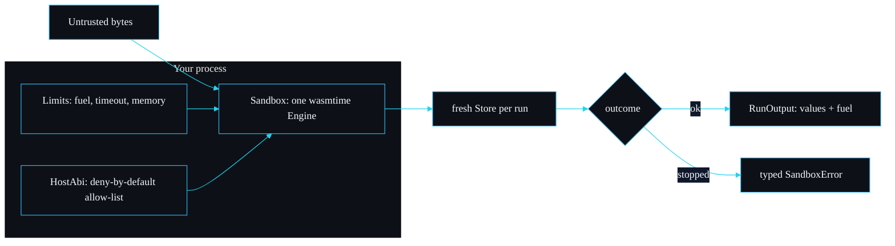

# sandboxd

A WebAssembly sandbox for running untrusted code with CPU, wall-clock and memory limits and a deny-by-default host ABI.

This wiki is the reference for adopters. If you have 30 seconds, read the diagram and the table below. If you have longer, the sidebar groups every page by what you are trying to do: understand it, look something up, operate it, reason about its security, extend it, or decide whether to adopt it.

## The whole system in one picture



You hand sandboxd some bytes that might be hostile. It compiles them with wasmtime, checks every import against an allow-list you control, then runs an exported function inside a fresh store with a fuel budget, a wall-clock deadline and a memory cap. Behave, and you get a value plus the fuel it burned. Misbehave, and it is stopped with a typed error that says exactly why.

## Where to go next

| If you want to | Read |
| --- | --- |
| understand the code layout and the run flow | [Architecture](Architecture) |
| follow `Sandbox::run` line by line | [The Sandbox Engine](The-Sandbox-Engine) |
| see how the wall-clock deadline is enforced | [The Watchdog and Epoch Interruption](The-Watchdog-and-Epoch-Interruption) |
| look up a type or method signature | [API Reference](API-Reference) |
| know exactly what is and is not defended | [Threat Model](Threat-Model) |
| tune fuel, timeout and the memory cap | [Resource Limits](Resource-Limits) and [Configuration and Tuning](Configuration-and-Tuning) |
| see measured numbers from this machine | [Performance and Benchmarks](Performance-and-Benchmarks) |
| grant a capability or add your own safely | [Host ABI](Host-ABI) and [Writing a Host Capability](Writing-a-Host-Capability) |
| compile a guest that sandboxd will accept | [Writing a Guest Module](Writing-a-Guest-Module) |
| copy a working snippet | [Examples and Recipes](Examples-and-Recipes) |
| drive the binary against a module | [CLI Usage](CLI-Usage) |
| decode an error you hit | [Troubleshooting](Troubleshooting) and [Error Reference](Error-Reference) |
| understand why it is built this way | [Design Decisions](Design-Decisions) |
| see how it stacks up against alternatives | [Comparisons](Comparisons) |
| see what is planned and what is out of scope | [Roadmap and Limitations](Roadmap-and-Limitations) |

## Quick orientation in code

The public surface is small on purpose:

```rust
use std::time::Duration;
use sandboxd::{Sandbox, Limits, Value};

let sandbox = Sandbox::deny_all()?;
let limits = Limits::new(1_000_000, Duration::from_millis(500), 1 << 20);
let out = sandbox.run(wat_bytes, "add", &[Value::I32(2), Value::I32(40)], &limits)?;
assert_eq!(out.values, vec![Value::I32(42)]);
# Ok::<(), sandboxd::SandboxError>(())
```

- `Sandbox` (`src/sandbox.rs`) owns a configured wasmtime engine and runs modules.
- `Limits` (`src/limits.rs`) carries the fuel budget, the timeout and the memory and table caps.
- `HostAbi` (`src/host.rs`) decides which imports the guest is allowed to use.
- `SandboxError` (`src/error.rs`) is the typed reason a run did not complete normally.

## Design principles

1. **Deny by default.** Nothing is granted unless the embedder asks for it by name. There is no WASI.
2. **Independent limits.** Fuel, time and memory are three separate fences. A guest that slips past one is caught by the others.
3. **Typed failures.** Every stop reason is a distinct variant, so callers branch on the reason rather than parsing strings.
4. **Determinism where it matters.** A pure module burns the same fuel on every run, which makes the CPU bound replayable.
5. **A small, auditable surface.** The host boundary is a single file you can read in a few minutes.

## At a glance

| Property | Value |
| --- | --- |
| Language | Rust, edition 2021, MSRV 1.80 |
| Runtime | wasmtime 45, Cranelift backend |
| Public types | `Sandbox`, `Limits`, `HostAbi`, `Value`, `RunOutput`, `SandboxError`, `LogSink` |
| Source files | six, the largest under 360 lines |
| Tests | 11 integration tests plus one doc-test, run in 0.13 s on an M3 Pro |
| Licence | MIT |

---
SarmaLinux . sarmalinux.com . [repo](https://github.com/sarmakska/sandboxd)
