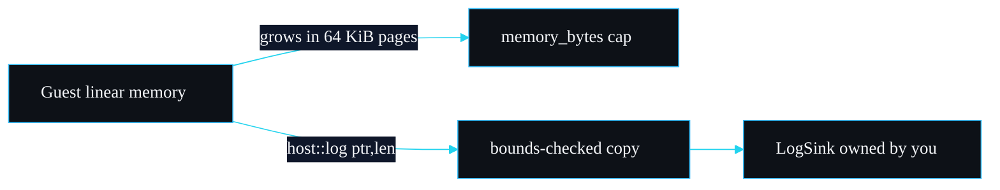

# Module Format and WAT

What sandboxd accepts as input, what shape a module must have to run, and how to read the five shipped fixtures. This page is the bridge between "I have some code" and "sandboxd runs it". For compiling a guest from a real language, see [Writing a Guest Module](Writing-a-Guest-Module).

## What `run` accepts

`Sandbox::run` and `Sandbox::compile` both take `&[u8]`. wasmtime parses both binary `.wasm` and textual `.wat` from the same bytes, because the `wat` feature is enabled in `Cargo.toml`:

```toml
wasmtime = { version = "45", default-features = false, features = ["cranelift", "runtime", "parallel-compilation", "gc-drc", "wat"] }
```

So you can pass:

- a compiled `.wasm` binary (what a real toolchain emits), or
- `.wat` text source (what the fixtures are, and what is convenient for tests and examples).

Anything that is neither becomes `SandboxError::InvalidModule`. The `invalid_module_is_reported` test feeds it `b"this is not wasm"` and asserts that variant.

## The contract a module must satisfy

A module sandboxd can run successfully has to meet a short list:

1. **It exports the function you ask for.** `run(bytes, "add", ...)` needs an `(export "add" ...)`. A missing export is `SandboxError::Export`.
2. **That function's parameters match the `Value`s you pass**, in count and scalar type. The supported types are `i32`, `i64`, `f32`, `f64`. A mismatch is `SandboxError::Export`, caught by `check_signature` before the call.
3. **It imports nothing the host did not grant.** The default grants nothing; `allow_log` grants `host::log`. Anything else is `SandboxError::DisallowedImport`.
4. **If it uses `host::log`, it exports its linear memory as `memory`.** The host reads the log string out of that memory by name. Without it the host call traps with a clear message.
5. **It stays within the fuel, time and memory limits.** Otherwise it is stopped with the matching error.

That is the whole contract. There is no manifest, no required entry point name (the CLI defaults to `run`, but the library lets you name any export), and no metadata.

## Reading the fixtures

The five `.wat` files in `fixtures/` are both the test corpus and the documentation of each behaviour. Each one is small enough to read in full.

### `well_behaved.wat`: the happy path

```wat
(module
  (func (export "add") (param i32 i32) (result i32)
    local.get 0
    local.get 1
    i32.add)

  (func (export "fib") (param $n i32) (result i32)
    (local $a i32) (local $b i32) (local $i i32) (local $tmp i32)
    (local.set $a (i32.const 0))
    (local.set $b (i32.const 1))
    (local.set $i (i32.const 0))
    (block $done
      (loop $next
        (br_if $done (i32.ge_s (local.get $i) (local.get $n)))
        (local.set $tmp (i32.add (local.get $a) (local.get $b)))
        (local.set $a (local.get $b))
        (local.set $b (local.get $tmp))
        (local.set $i (i32.add (local.get $i) (i32.const 1)))
        (br $next)))
    local.get $a))
```

Two pure functions, no imports, no memory. `add` returns the sum of two i32s. `fib` computes a Fibonacci number iteratively. Both terminate quickly and deterministically, so they run under any sane limits. `fib` is the determinism witness: `fib(20)` returns 6765 and burns identical fuel on every run, which the `pure_module_is_deterministic` test asserts.

### `infinite_loop.wat`: the compute attack

```wat
(module
  (func (export "run")
    (loop $spin
      br $spin)))
```

A back-edge loop with no exit. Stopped two independent ways: fuel runs out (`FuelExhausted`), or with near-infinite fuel the watchdog interrupts it at the deadline (`Timeout`). The `br $spin` back-edge is exactly where the epoch check lives, which is why the watchdog can stop it.

### `memory_bomb.wat`: the memory attack

```wat
(module
  (memory (export "memory") 1)
  (func (export "run")
    (loop $grow
      (i32.const 16)
      memory.grow
      (i32.const -1)
      i32.eq
      (if (then unreachable))
      br $grow)))
```

Grows linear memory 16 pages (1 MiB) at a time in a loop. When the cap is reached, `memory.grow` returns -1, the guest compares to -1 and executes `unreachable`. sandboxd reports `MemoryLimitExceeded` because the limiter recorded the denied growth, regardless of the `unreachable`.

### `disallowed_import.wat`: the capability attack

```wat
(module
  (import "env" "secret" (func $secret (result i32)))
  (func (export "run") (result i32)
    call $secret))
```

Imports `env::secret`, which sandboxd does not provide. Rejected at instantiation with `DisallowedImport` naming `env::secret`, before `run` ever executes.

### `logger.wat`: the audited capability

```wat
(module
  (import "host" "log" (func $log (param i32 i32)))
  (memory (export "memory") 1)
  (data (i32.const 0) "hello from the guest")
  (func (export "run")
    (call $log (i32.const 0) (i32.const 20))))
```

Stores 20 bytes into linear memory at offset 0 and calls `host::log` with that pointer and length. Denied by default (`DisallowedImport`), captured when granted (`allow_log`). Note the `(memory (export "memory") 1)`: that export is what lets the host read the string.

## How `host::log` reads guest memory

The ABI for the one shipped capability is `(ptr: i32, len: i32) -> ()`. The guest writes a UTF-8 string into its own linear memory and passes the offset and length. The host copies it out with full bounds checking and never hands a pointer back. The detail, including the overflow and out-of-bounds guards, is on the [Host ABI](Host-ABI) page.

## The page model



WebAssembly linear memory is a contiguous byte array that grows in 64 KiB pages. The `memory_bytes` limit caps its total size, rounded down to a page boundary. The guest addresses it with plain integer offsets, which is why the `host::log` bounds check validates `ptr` and `ptr + len` against the actual memory size before reading.

---
SarmaLinux . sarmalinux.com . [repo](https://github.com/sarmakska/sandboxd)
