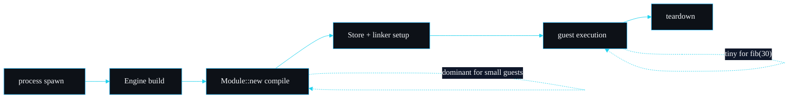

# Performance and Benchmarks

Real numbers from running sandboxd on my own machine. No synthetic figures, no projections. Every result below comes from the commands shown, so you can reproduce them.

## The machine

| | |
| --- | --- |
| Hardware | Apple M3 Pro (Mac15,7), arm64 |
| OS | macOS 26.3 (Darwin 25.3) |
| Toolchain | rustc 1.96.0, cargo 1.96.0 |
| Build | `cargo build --release` (opt-level 3, thin LTO) |
| Runtime | wasmtime 45, Cranelift backend |

## Build and binary

| Metric | Value | How |
| --- | --- | --- |
| Release binary size | 12 MB (12,277,104 bytes) | `ls -la target/release/sandboxd` |
| Incremental rebuild after touching `src/lib.rs` | 14.67 s | `touch src/lib.rs && cargo build --release` |
| First clean build | minutes, dominated by compiling wasmtime and Cranelift | one-off |

The binary is 12 MB because it statically links wasmtime and the Cranelift code generator. The first build is slow for the same reason; later builds reuse the cached crate artefacts, and CI caches the registry and `target` to keep pipeline times down.

## Fuel costs

Fuel is deterministic, so these are exact and repeatable, not averages.

| Call | Returns | Fuel consumed |
| --- | --- | --- |
| `add(2, 40)` | `I32(42)` | 4 |
| `fib(10)` | `I32(55)` | 182 |
| `fib(20)` | `I32(6765)` | 352 |
| `fib(30)` | `I32(832040)` | 522 |

Reproduce:

```bash
./target/release/sandboxd fixtures/well_behaved.wat --invoke fib --arg 30
# result: I32(832040)
# fuel consumed: 522   (on stderr)
```

The determinism is the property I care about most. `fib(30)` consumes exactly 522 fuel on every single run, which is what lets fuel double as a quota or a billing unit you can reproduce. The `pure_module_is_deterministic` test asserts this across three fresh sandboxes.

## End-to-end latency

Cold CLI invocation includes process spawn, module compile and the run. These are the figures an operator actually sees.

| Scenario | Wall time | Notes |
| --- | --- | --- |
| 100 cold invocations of `fib(30)` | 1.025 s total | about 10.3 ms per process including OS spawn and compile |
| Fuel exhaustion, `infinite_loop.wat`, 1,000,000 fuel | about 29 ms | exit code 2 |
| Memory bomb, `memory_bomb.wat`, 4 MiB cap | about 28 ms | exit code 4 |
| Wall-clock timeout, 100 ms deadline, near-infinite fuel | 145 to 147 ms across three runs | exit code 3; the extra over 100 ms is spawn and compile, not slack |

Reproduce the loop figure:

```bash
time (for i in $(seq 1 100); do \
  ./target/release/sandboxd fixtures/well_behaved.wat --invoke fib --arg 30 >/dev/null 2>&1; \
done)
# ~1.025s total
```

Most of the per-invocation cost is process startup and the per-run module compile, not the guest execution. `fib(30)` is 522 fuel; the compute itself is sub-millisecond. For an embedder that calls `Sandbox::run` in-process the spawn cost disappears, and the dominant cost becomes compilation, which is why precompilation and an artefact cache are on the [roadmap](Roadmap-and-Limitations).

## Where the time goes



For the small fixtures the order is roughly: process spawn and compile dominate, store and watchdog setup are cheap, and the guest run itself is negligible. Heavier guests shift the balance toward execution.

## Test suite

| Metric | Value |
| --- | --- |
| Integration tests | 11, in `tests/sandbox.rs` |
| Doc-tests | 1, the quick-start in `src/lib.rs` |
| Integration run time | 0.13 s |
| Doc-test run time | 0.07 s |

```bash
cargo test --release
# test result: ok. 11 passed; 0 failed ... finished in 0.13s
# Doc-tests sandboxd: 1 passed ... finished in 0.07s
```

The suite is fast because each test compiles a tiny WAT fixture and runs it once. The slow part of any change to this project is compiling wasmtime, not running the tests.

## Reading these numbers

- The fuel figures are exact and portable; they do not change with the machine.
- The latency figures are this machine and this build. A slower CPU or a debug build will be slower, especially the compile step.
- The 10.3 ms per cold invocation is a process-level figure. In-process embedding is faster per call because spawn cost is paid once.
- None of these are micro-optimised. sandboxd's job is correctness of the isolation boundary first; the numbers are here so you can size your deployment, not to win a benchmark.

---
SarmaLinux . sarmalinux.com . [repo](https://github.com/sarmakska/sandboxd)
