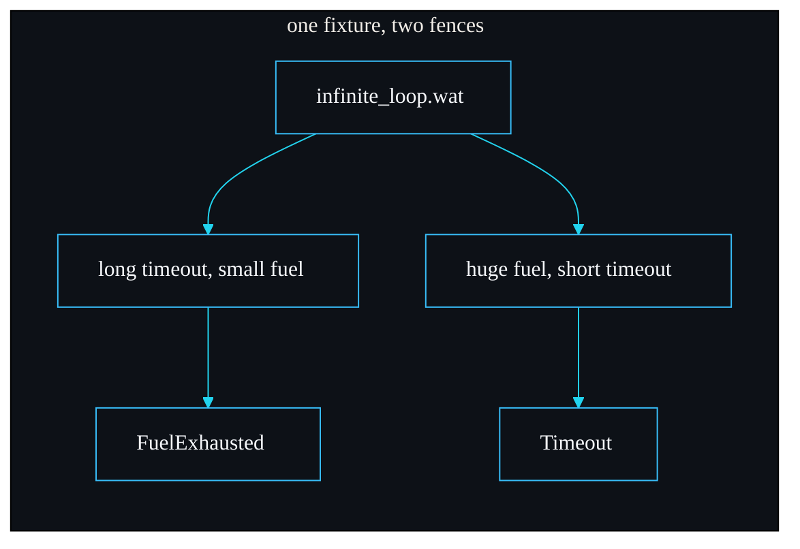

# Testing Strategy

How sandboxd is tested, and why the suite is shaped the way it is. The whole point of the project is an isolation boundary, so the tests are written to prove each guarantee in the [Threat Model](Threat-Model) against a real hostile fixture, not to chase a coverage number.

## The shape of the suite

There are two layers:

1. **Integration tests** in `tests/sandbox.rs`, eleven of them, each driving a `.wat` fixture through the public library API.
2. **A doc-test** in `src/lib.rs`, the quick-start example, which proves the README-level snippet actually compiles and runs.

There are no unit tests on private functions. That is deliberate: the contract this project makes is at the public surface (a hostile module is stopped, a clean error is returned), so the tests exercise that surface end to end. Testing `classify_trap` in isolation would prove less than running an infinite loop and asserting `FuelExhausted`.

## The fixtures are the test corpus

Each fixture in `fixtures/` encodes one hostile or well-behaved behaviour, and each is referenced by `include_str!` at the top of the test file:

```rust
const INFINITE_LOOP: &str = include_str!("../fixtures/infinite_loop.wat");
const MEMORY_BOMB: &str = include_str!("../fixtures/memory_bomb.wat");
const DISALLOWED_IMPORT: &str = include_str!("../fixtures/disallowed_import.wat");
const WELL_BEHAVED: &str = include_str!("../fixtures/well_behaved.wat");
const LOGGER: &str = include_str!("../fixtures/logger.wat");
const RANDOM: &str = include_str!("../fixtures/random.wat");
const GROW_WITHIN_CAP: &str = include_str!("../fixtures/grow_within_cap.wat");
```

This means the attack table in the README and the [Threat Model](Threat-Model) is executable: every row is backed by a test that runs the actual malicious module and asserts the actual error variant. The fixtures are documented in [Module Format and WAT](Module-Format-and-WAT).

## What each test proves

| Test | Fixture | Asserts |
| --- | --- | --- |
| `fuel_exhaustion_terminates` | infinite loop | a long timeout but small fuel stops it with `FuelExhausted { budget: 1_000_000 }` |
| `epoch_timeout_terminates` | infinite loop | `u64::MAX` fuel but a 100 ms timeout stops it with `Timeout { millis: 100 }`, and in under five seconds |
| `memory_cap_enforced` | memory bomb | a 4 MiB cap stops it with `MemoryLimitExceeded { limit: 4 MiB }` |
| `disallowed_import_rejected` | disallowed import | rejected with `DisallowedImport { env, secret }` before any code runs |
| `log_import_denied_by_default` | logger | even `host::log` is denied without a grant: `DisallowedImport { host, log }` |
| `allowed_import_works` | logger | with `allow_log`, the run succeeds and the sink holds exactly `["hello from the guest"]` |
| `random_import_denied_by_default` | random | `host::random` is denied without a grant: `DisallowedImport { host, random }` |
| `seeded_random_is_deterministic` | random | with `allow_random(seed)`, the same seed yields the same value across fresh sandboxes |
| `different_seeds_diverge` | random | two different seeds produce different values, so the seed actually steers the stream |
| `peak_memory_is_reported` | grow-within-cap, well-behaved | a bounded growth reports `peak_memory_bytes == 2 MiB`; a pure run reports `0` |
| `well_behaved_returns_value` | well-behaved | `add(2, 40)` returns `I32(42)` and reports fuel consumed |
| `pure_module_is_deterministic` | well-behaved | `fib(20)` returns `6765` and burns identical fuel across three fresh sandboxes |
| `missing_export_is_reported` | well-behaved | calling a non-existent export gives `Export`, not a panic |
| `signature_mismatch_is_reported` | well-behaved | wrong argument arity gives `Export`, not a panic |
| `invalid_module_is_reported` | (raw bytes) | `b"this is not wasm"` gives `InvalidModule`, not a panic |

## The two design properties the suite is built to prove

**Independent fences.** The infinite loop appears in two tests on purpose. `fuel_exhaustion_terminates` gives it a long timeout so only fuel can stop it. `epoch_timeout_terminates` gives it near-infinite fuel so only the watchdog can stop it. One fixture, two independent mechanisms, each proven alone. This is the redundancy that the whole design rests on.

**Determinism.** `pure_module_is_deterministic` runs `fib(20)` three times in three freshly built sandboxes and asserts not just the same return value but the same `fuel_consumed`. That is the property that makes fuel usable as a quota, and it is checked rather than assumed.



## Running the tests

```bash
export PATH="$HOME/.cargo/bin:/opt/homebrew/bin:$PATH"
cargo test --release
```

On an Apple M3 Pro the integration suite runs in 0.13 s and the doc-test in 0.07 s. The slow part of any change is compiling wasmtime, not running the tests.

## What CI enforces

The workflow in `.github/workflows/ci.yml` runs on push and pull request to `main`, with `RUSTFLAGS: "-D warnings"` so any warning fails the build. The steps:

1. `cargo fmt --all --check`, formatting must be clean.
2. `cargo clippy --all-targets --all-features -- -D warnings`, lints must pass with no warnings.
3. `cargo build --verbose`.
4. `cargo test --verbose`.

The registry and `target` directory are cached on the `Cargo.lock` hash to keep the wasmtime compile from dominating pipeline time.

## Gaps I am honest about

- **No fuzzing.** A fuzzer feeding random bytes to `compile` and `run` would harden the `InvalidModule` and trap paths. It is not in the suite today.
- **No property tests.** The determinism check is by example (`fib(20)` three times), not a property over many inputs.
- **No benchmark regression gate.** The numbers in [Performance and Benchmarks](Performance-and-Benchmarks) are measured by hand, not asserted in CI.

These are the kind of additions a contributor could make; see [Contributing](Contributing).

---
SarmaLinux . sarmalinux.com . [repo](https://github.com/sarmakska/sandboxd)
