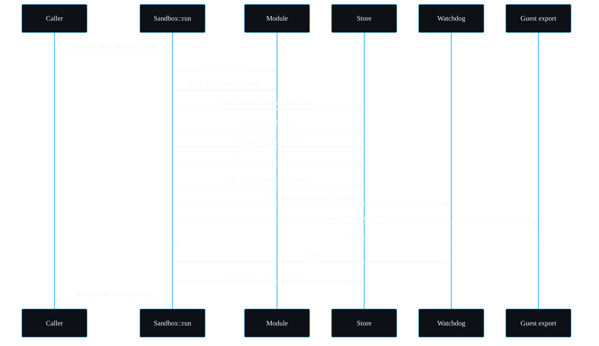

# The Sandbox Engine

This page walks `Sandbox::run` in `src/sandbox.rs` line by line. The [Architecture](Architecture) page gives the high-level flow; this one is for when you want to know exactly what happens, in what order, and why each step is where it is. If you are auditing the isolation boundary, read this and [Host ABI](Host-ABI) together.

## The type and its engine

```rust
pub struct Sandbox {
    engine: Engine,
    host: HostAbi,
}
```

A `Sandbox` is two things: a configured wasmtime `Engine` and the `HostAbi` that decides what the guest may import. The engine is built once in `Sandbox::new`:

```rust
let mut config = Config::new();
config.consume_fuel(true);
config.epoch_interruption(true);
config.cranelift_opt_level(wasmtime::OptLevel::Speed);
let engine = Engine::new(&config)?;
```

Three settings, and the whole design leans on them.

- `consume_fuel(true)` turns on per-instruction metering. Without it `store.set_fuel` and `store.get_fuel` would not work and the CPU bound would not exist.
- `epoch_interruption(true)` turns on the cooperative interrupt the watchdog uses. Without it `store.set_epoch_deadline` and `engine.increment_epoch` would do nothing and the wall-clock bound would not exist.
- `cranelift_opt_level(Speed)` is set explicitly rather than left to the default so startup behaviour is predictable across wasmtime versions.

The engine holds the expensive compiled artefacts and the Cranelift backend. It is reference counted internally and `Clone` is cheap, which is why the watchdog can take `self.engine.clone()` without copying anything heavy.

## The run, step by step



### 1. Compile

```rust
let module = self.compile(bytes)?;
```

`compile` calls `Module::new(&self.engine, bytes)`. wasmtime parses both `.wasm` and `.wat`, so either form works. A parse or validation failure becomes `SandboxError::InvalidModule` with wasmtime's message attached. No guest code runs at this stage; compilation is pure translation and validation.

### 2. Reject disallowed imports

```rust
self.reject_disallowed_imports(&module)?;
```

Before building a store, sandboxd walks `module.imports()` and rejects anything not on the allow-list, naming the exact import in `SandboxError::DisallowedImport`. The only thing the default ABI permits is `host::log`, and only when the log capability is granted. This runs first so a hostile import is turned away before any store or guest setup exists. See [Host ABI](Host-ABI) for the allow-list logic and why this is belt-and-braces with the linker.

### 3. Build a fresh store with the limiter

```rust
let mut store = Store::new(&self.engine, StoreState::new(limits));
store.limiter(|state| state);
```

`StoreState` (in `src/limits.rs`) carries the `StoreLimits` and a `growth_denied` flag, and implements `wasmtime::ResourceLimiter`. The `store.limiter(|state| state)` call tells wasmtime to consult that state on every attempted memory or table growth. A fresh store per run is what guarantees runs share no fuel, no memory, no globals; see "Why a fresh store per run" in [Architecture](Architecture).

### 4. Apply the fuel budget

```rust
store.set_fuel(limits.fuel)
    .map_err(|e| SandboxError::Host(format!("failed to set fuel: {e}")))?;
```

This loads the instruction budget onto the store. From here every instruction the guest executes deducts one or more fuel units; hitting zero traps with `Trap::OutOfFuel`.

### 5. Arm the epoch deadline

```rust
store.set_epoch_deadline(1);
```

The store will interrupt after one epoch tick. The tick comes from the watchdog (step 7). Setting it to `1` means the very next `increment_epoch` from the watchdog trips the guest. See [The Watchdog and Epoch Interruption](The-Watchdog-and-Epoch-Interruption).

### 6. Build the linker and instantiate

```rust
let mut linker: Linker<StoreState> = Linker::new(&self.engine);
self.host.register(&mut linker)?;
let instance = linker
    .instantiate(&mut store, &module)
    .map_err(|e| map_instantiation_error(e, &module, &self.host))?;
```

`HostAbi::register` defines only the granted imports on the linker. If the module needs something undefined, `instantiate` fails, and `map_instantiation_error` translates a missing or incompatible import back into `DisallowedImport` so both the pre-check and the linker agree on the error.

### 7. Resolve the export and check its signature

```rust
let function = instance.get_func(&mut store, func)
    .ok_or_else(|| SandboxError::Export(...))?;
self.check_signature(&store, &function, params, func)?;
```

A missing export is `SandboxError::Export`. `check_signature` compares the supplied `Value`s against the function's declared parameter types and arity, so a wrong count or a type mismatch is a clean error rather than a panic inside wasmtime.

### 8. Arm the watchdog and call

```rust
let watchdog = Watchdog::arm(self.engine.clone(), limits.timeout);
let call_result = function.call(&mut store, &call_params, &mut results);
watchdog.disarm();
```

The watchdog is armed immediately before the call and disarmed immediately after, so the wall-clock window covers exactly the guest's execution and nothing else. `results` is pre-sized with `default_val` for each declared result type.

### 9. Read fuel and classify the outcome

```rust
let fuel_consumed = store.get_fuel().ok()
    .map(|remaining| limits.fuel.saturating_sub(remaining));

match call_result {
    Ok(()) => Ok(RunOutput { values, fuel_consumed }),
    Err(trap) => {
        if store.data().growth_was_denied() {
            return Err(SandboxError::MemoryLimitExceeded { limit: limits.memory_bytes });
        }
        Err(classify_trap(trap, limits))
    }
}
```

Fuel consumed is computed from the remaining fuel, saturating so it cannot underflow. On success the raw `Val` results are converted to `Value` (rejecting any unsupported return type). On failure the memory-cap check comes first, then `classify_trap` maps wasmtime trap codes to `SandboxError`. The ordering of that check is the subtle part and is explained next.

## Trap classification

```rust
fn classify_trap(err: wasmtime::Error, limits: &Limits) -> SandboxError {
    if let Some(trap) = err.downcast_ref::<Trap>() {
        match trap {
            Trap::OutOfFuel => return SandboxError::FuelExhausted { budget: limits.fuel },
            Trap::Interrupt => return SandboxError::Timeout { millis: limits.timeout.as_millis() as u64 },
            Trap::MemoryOutOfBounds | Trap::TableOutOfBounds =>
                return SandboxError::MemoryLimitExceeded { limit: limits.memory_bytes },
            _ => {}
        }
    }
    SandboxError::Trap(err.to_string())
}
```

The `growth_was_denied()` check in `run` happens **before** this function, on purpose. When a guest hits the memory cap, `memory.grow` returns -1 and the guest can react in any way it likes: a fixture might execute `unreachable`, another might do an out-of-bounds store, another might just trap. All of those should be reported as a memory breach, not as a generic trap or an out-of-bounds. Recording the denial in the limiter and checking it first makes the attribution correct regardless of the guest's reaction. The `MemoryOutOfBounds`/`TableOutOfBounds` arm in `classify_trap` is the fallback for the cases the limiter did not flag.

## Default result values

```rust
fn default_val(ty: ValType) -> Val {
    match ty {
        ValType::I32 => Val::I32(0),
        ValType::I64 => Val::I64(0),
        ValType::F32 => Val::F32(0),
        ValType::F64 => Val::F64(0),
        _ => Val::I32(0),
    }
}
```

The results vector is pre-filled with zero values of the right type before the call, because `Func::call` writes into a caller-provided slice. The values are overwritten by the actual results on success and ignored on failure.

## Where each error comes from

| Stage | Possible error |
| --- | --- |
| compile | `InvalidModule` |
| reject_disallowed_imports | `DisallowedImport` |
| set_fuel | `Host` |
| instantiate | `DisallowedImport` (via `map_instantiation_error`) or `Host` |
| get_func / check_signature | `Export` |
| function.call | `MemoryLimitExceeded`, `FuelExhausted`, `Timeout`, or `Trap` |
| result conversion | `Export` (unsupported return type) |

---
SarmaLinux . sarmalinux.com . [repo](https://github.com/sarmakska/sandboxd)
