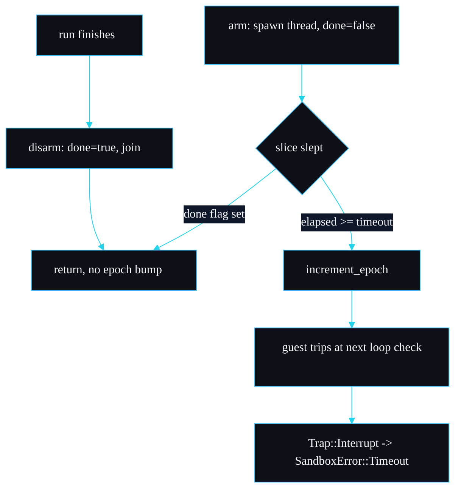

# The Watchdog and Epoch Interruption

The wall-clock deadline is the limit that catches a guest fuel cannot. This page explains how it works, why it is built from a per-run thread rather than a global ticker, and the exact failure modes around it. The code is the `Watchdog` struct in `src/sandbox.rs`.

## Why a second fence at all

Fuel bounds instructions, not time. Two situations slip past a fuel-only design:

1. **Host-call time.** Once you grant a capability, time spent inside the host function does not consume fuel. A guest that calls a slow granted function in a loop burns almost no fuel while holding a thread.
2. **Descheduling.** If the OS deschedules the thread, wall-clock time passes while no fuel is consumed.

The wall-clock deadline closes both. It is a safety net rather than a primary control: prefer fuel for predictable CPU bounds, and set the timeout comfortably above the worst-case fuel-bounded run time so it only fires for genuinely stuck guests. See [Configuration and Tuning](Configuration-and-Tuning).

## How wasmtime epoch interruption works

Epoch interruption is cooperative. wasmtime maintains an epoch counter on the engine. When compiled code reaches a loop back-edge or a function entry, it compares the engine's current epoch against the store's deadline. If the deadline has passed, the guest traps with `Trap::Interrupt`. The counter does not advance on its own; something has to call `engine.increment_epoch()`.

sandboxd arms it in two parts:

```rust
store.set_epoch_deadline(1);                              // in Sandbox::run
let watchdog = Watchdog::arm(self.engine.clone(), limits.timeout);
```

`set_epoch_deadline(1)` says: interrupt after the engine epoch advances once from where it is now. The watchdog provides that single advance, at the right moment.

## The watchdog thread

```rust
struct Watchdog {
    done: Arc<std::sync::atomic::AtomicBool>,
    handle: Option<thread::JoinHandle<()>>,
}

impl Watchdog {
    fn arm(engine: Engine, timeout: Duration) -> Self {
        let done = Arc::new(AtomicBool::new(false));
        let done_clone = done.clone();
        let handle = thread::spawn(move || {
            let slice = Duration::from_millis(5).min(timeout.max(Duration::from_millis(1)));
            let mut elapsed = Duration::ZERO;
            while elapsed < timeout {
                if done_clone.load(Ordering::Relaxed) {
                    return;
                }
                thread::sleep(slice);
                elapsed += slice;
            }
            engine.increment_epoch();
        });
        Self { done, handle: Some(handle) }
    }

    fn disarm(mut self) {
        self.done.store(true, Ordering::Relaxed);
        if let Some(handle) = self.handle.take() {
            let _ = handle.join();
        }
    }
}
```

The thread sleeps in 5 ms slices rather than one long sleep. Each slice it checks the shared `done` flag. Two outcomes:

- **The run finishes first.** `disarm` sets `done` to true and joins the thread. On its next wake the thread sees the flag and returns without ever bumping the epoch. A fast run pays only the spawn-and-join cost, no idle wait.
- **The deadline elapses first.** `elapsed` reaches `timeout`, the loop exits, and the thread calls `engine.increment_epoch()`. The next epoch check inside the guest sees the bump and traps with `Trap::Interrupt`, which `classify_trap` turns into `SandboxError::Timeout`.



The slice size is `5ms.min(timeout.max(1ms))`. For a normal timeout it is 5 ms. For a sub-5 ms timeout it shrinks to at least 1 ms so a tiny deadline still polls. This bounds how long after `disarm` the thread lingers (one slice) and how much past the deadline the bump can land (one slice).

## Measured behaviour

On an Apple M3 Pro (macOS 26.3, Rust 1.96, release build), driving the infinite-loop fixture with a 100 ms deadline and near-infinite fuel through the CLI:

```
run 1 exit=3 wall=147ms
run 2 exit=3 wall=145ms
run 3 exit=3 wall=146ms
```

The guest is stopped at exit code 3 (`Timeout`) every time, around 145 to 147 ms end to end. The extra over 100 ms is process spawn plus module compile, not deadline slack; the deadline itself fires within one 5 ms slice of 100 ms. The `epoch_timeout_terminates` integration test asserts the same property in-process and confirms the elapsed time stays well under five seconds.

## Why a per-run watchdog, not a global ticker

The common pattern is one long-lived background thread that calls `increment_epoch` on a fixed cadence, say every millisecond, for the life of the process. Stores set their deadline to "now plus N ticks". I rejected that here.

| | Global ticker | Per-run watchdog (chosen) |
| --- | --- | --- |
| Timing precision | coarse, shared cadence | each run gets its exact deadline |
| Idle cost | a thread bumps forever, even with no runs | no thread exists between runs |
| Early exit | run waits for the shared cadence to express its deadline | `done` flag stops the thread the instant the call returns |
| Code | slightly less | one `arm`/`disarm` pair per run |
| Cost paid | none per run | one thread spawn per run |

The per-run watchdog gives precise, independent deadlines and no idle thread, at the cost of one `thread::spawn` per run. Against the cost of compiling and running a module (tens of milliseconds in the benchmarks), a thread spawn is in the noise. This trade-off is also recorded in [Design Decisions](Design-Decisions).

## Failure modes

- **A guest with no loops and no calls.** Epoch checks sit at back-edges and function entries. A straight-line function with neither will not check the epoch, but it also cannot run for long, and fuel still bounds it. In practice anything that runs long enough to matter has a loop, which is checked.
- **A run that finishes within one slice of the deadline.** The thread may have already decided to bump. The `done` flag is best-effort: if the bump and the disarm race, the worst case is a spurious epoch increment that the next (already-finished) run does not observe, because each run sets its own fresh deadline relative to the engine's current epoch. No correctness issue, at most a wasted increment.
- **A very short timeout.** Sub-millisecond timeouts are rounded up to a 1 ms slice. Do not expect microsecond-precision deadlines; this is a safety net, not a real-time scheduler.

---
SarmaLinux . sarmalinux.com . [repo](https://github.com/sarmakska/sandboxd)
