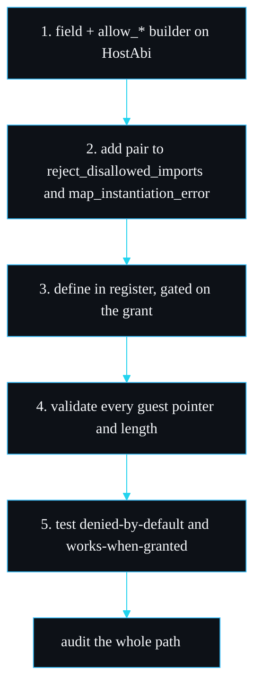

# Writing a Host Capability

How to extend the host ABI with a new capability without weakening the isolation boundary. The shipped `host::log` in `src/host.rs` is the worked reference, and every new capability should follow the same five-step discipline. This page is the long form of the recipe summarised on [Host ABI](Host-ABI).

## The principle

The host ABI is the one place where the guest touches your process. Every capability you add widens what an untrusted module can reach, so the bar is high: a capability is safe only if a fully hostile guest, passing the worst arguments it can, cannot read host memory, corrupt host state, or escape its limits. Deny-by-default means the default stays safe; your job is to keep each addition safe too.

## The five steps

### 1. Add a field and an `allow_*` builder

The state that says "this capability is granted" lives on `HostAbi`. For `host::log` it is an `Option<LogSink>`:

```rust
#[derive(Clone, Default)]
pub struct HostAbi {
    log_sink: Option<LogSink>,
}

impl HostAbi {
    pub fn allow_log(mut self) -> (Self, LogSink) {
        let sink: LogSink = Arc::new(Mutex::new(Vec::new()));
        self.log_sink = Some(sink.clone());
        (self, sink)
    }
}
```

For your capability, add a field whose presence means "granted", and a builder that takes `self` by value, sets it, and returns the modified ABI (plus any handle the embedder needs to observe the effect, the way `allow_log` returns the sink). Keeping `allow_*` additive means there is no way to widen the ABI except by calling one.

### 2. Teach the import allow-list to recognise it

`reject_disallowed_imports` in `src/sandbox.rs` decides which imports are permitted. Today it hard-codes the single allowed pair:

```rust
let allowed = matches!(
    (import.module(), import.name(), self.host.log_allowed()),
    ("host", "log", true)
);
```

Add your `(module, name)` pair, gated on your capability being granted. The same recognition must be added to `map_instantiation_error`, which translates a late linker failure back into `DisallowedImport`. Both checks have to agree; that is the belt-and-braces design from [Design Decisions](Design-Decisions). If you add several capabilities, generalise these two `matches!` into a small allow-list table so they cannot drift apart.

### 3. Define the function in `register`, validating everything

`HostAbi::register` defines only the granted imports on the linker. For `host::log`:

```rust
pub(crate) fn register(&self, linker: &mut Linker<StoreState>) -> Result<()> {
    if let Some(sink) = &self.log_sink {
        let sink = sink.clone();
        linker.func_wrap(
            "host", "log",
            move |mut caller: Caller<'_, StoreState>, ptr: i32, len: i32| -> Result<()> {
                let line = read_guest_string(&mut caller, ptr, len)?;
                sink.lock().expect("log sink mutex poisoned").push(line);
                Ok(())
            },
        )?;
    }
    Ok(())
}
```

Define your function the same way: only when the capability is present, and validate every argument the guest controls before acting on it.

### 4. Never trust a guest pointer or length

This is where capabilities go wrong. `read_guest_string` is the template for reading from guest memory safely:

```rust
fn read_guest_string(caller: &mut Caller<'_, StoreState>, ptr: i32, len: i32) -> Result<String> {
    let memory = match caller.get_export("memory") {
        Some(Extern::Memory(m)) => m,
        _ => bail!("host::log requires the guest to export its linear memory as `memory`"),
    };
    let ptr = usize::try_from(ptr).map_err(|_| Error::msg("negative pointer in host::log"))?;
    let len = usize::try_from(len).map_err(|_| Error::msg("negative length in host::log"))?;
    let data = memory.data(&caller);
    let end = ptr.checked_add(len)
        .ok_or_else(|| Error::msg("pointer plus length overflows in host::log"))?;
    let bytes = data.get(ptr..end)
        .ok_or_else(|| Error::msg("host::log pointer or length out of bounds"))?;
    Ok(String::from_utf8_lossy(bytes).into_owned())
}
```

Read it as a checklist for any capability that touches guest memory:

- Negative `i32` pointers and lengths are rejected with `try_from`.
- `checked_add` rejects a `ptr + len` that would overflow.
- The slice is taken with `get`, which returns `None` (so an error, so a trap) if the range is out of bounds. The guest cannot read past its own memory, and certainly not host memory.
- `from_utf8_lossy` means malformed bytes become replacement characters rather than aborting the host.
- The host never hands a pointer or handle back to the guest, so there is no path from the import into host address space.

If your capability writes into guest memory rather than reading, apply the same bounds discipline to the write range.

### 5. Audit it and test it both ways

Write at least two tests, mirroring `log_import_denied_by_default` and `allowed_import_works`:

- one that proves the import is rejected with `DisallowedImport` when the capability is not granted, and
- one that proves it works and has exactly the intended effect when it is granted.

Add a hostile fixture if the capability takes guest-controlled arguments, the way `memory_bomb.wat` proves the memory cap. See [Testing Strategy](Testing-Strategy).

## The recipe as a flow



## What not to do

- Do not return a raw host pointer, handle, or file descriptor to the guest. The guest can name only what you give it; do not give it a key to host address space.
- Do not skip the allow-list update and rely on the linker alone. The explicit walk is what names the import in the error and rejects it before the store exists.
- Do not add network or filesystem access casually. Those are real trust decisions; see the non-goals in [Roadmap and Limitations](Roadmap-and-Limitations).
- Do not panic on bad guest input. Return an error so it becomes a clean trap, not a host abort. `read_guest_string` returns `Result` for exactly this reason.

The likely first additions, a monotonic clock and a seeded RNG, are on the roadmap precisely because they take no guest-controlled pointers and so are easy to make safe by this recipe.

---
SarmaLinux . sarmalinux.com . [repo](https://github.com/sarmakska/sandboxd)
